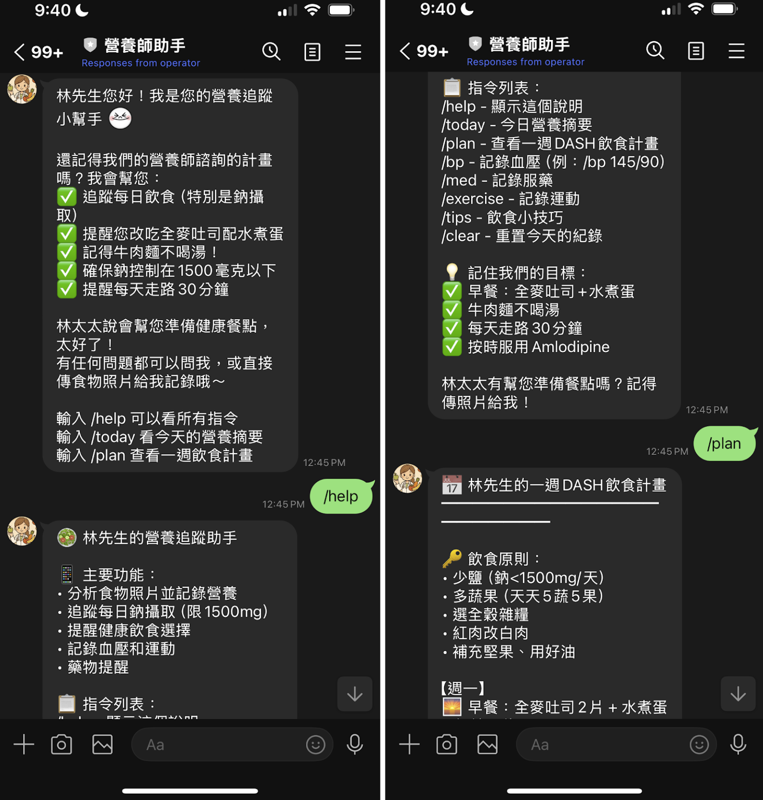
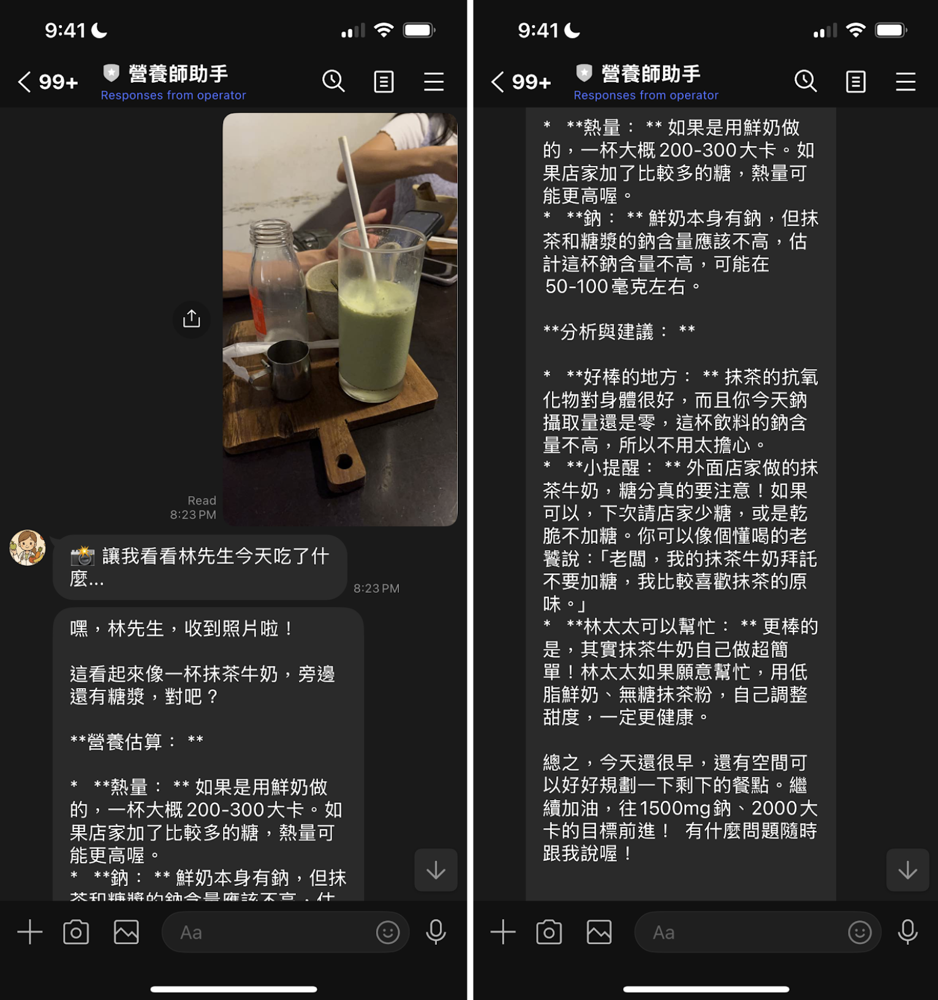

# 🥗 NutriLINE: Mr. Lin's AI-Powered Nutrition Assistant

A personalized LINE chatbot that helps a simulated patient (Mr. Lin) manage hypertension by tracking sodium intake, interpreting food photos, logging blood pressure and exercise, and providing culturally-aware health advice—all powered by Gemini Pro and LangChain.

📱 Messaging Platform: LINE  
🧠 AI Model: Gemini

---

## 🧠 Project Context

This project simulates a digital nutrition LINE bot for "Mr. Lin", a fictional Taiwanese patient with hypertension in my nutrition final presentation. The bot engages users as if they are Mr. Lin, processes text and image input, and responds with specific, personalized health guidance.

It’s built as a rapid prototype to demonstrate how AI can support chronic disease management and track daily nutrition.

---

## ✨ Features

- 📸 **Food photo analysis** with Gemini Pro vision model
- 🧂 **Nutrient tracking** with daily sodium, calories, protein, fat, and carbs
- 📋 **Custom meal plans** following DASH diet principles
- 📈 **Blood pressure tracking**
- 💊 **Medication reminders**
- 🏃 **Exercise logging**
- 💡 **Diet tips and motivation** 

---

## 🔧 Technologies

- Python + Flask
- LINE Messaging API
- Google Gemini API (Vision + Text)

---

## 👨‍⚕️ Simulated Patient Profile: Mr. Lin

- 55 years old, BMI 27
- Blood pressure: 145/92
- Dad had a stroke at 60 (major fear motivator)
- Sedentary job, only walks on weekends
- Loves salty Taiwanese food 
- Agreed to a DASH-aligned plan by nutritionist

---

## 📸 Screenshots

### 👋 Welcome Message + Command Help

  
*Bot introduces itself with a friendly tone, shares goals, and shows a list of supported commands tailored for Mr. Lin.*

---

### 📷 Food Photo Analysis + Nutrition Advice

  
*Bot receives a matcha milk tea photo, estimates nutrition, warns gently about sugar/sodium, and suggests alternatives using familiar language.*

---

